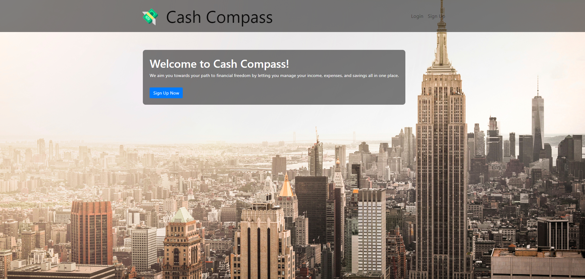
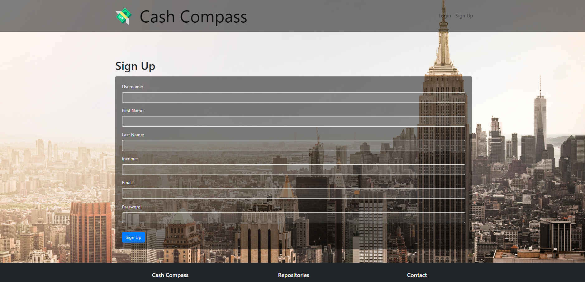
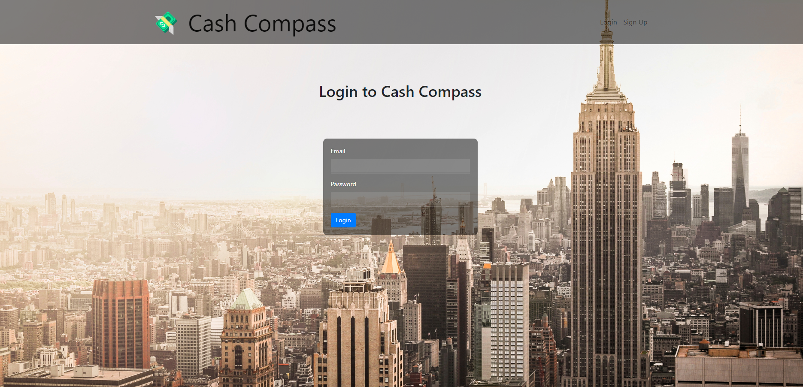
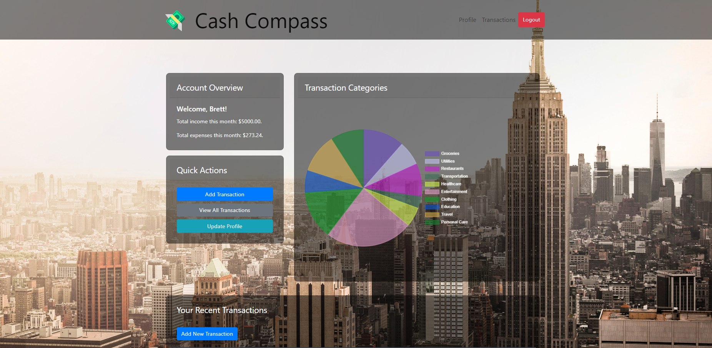
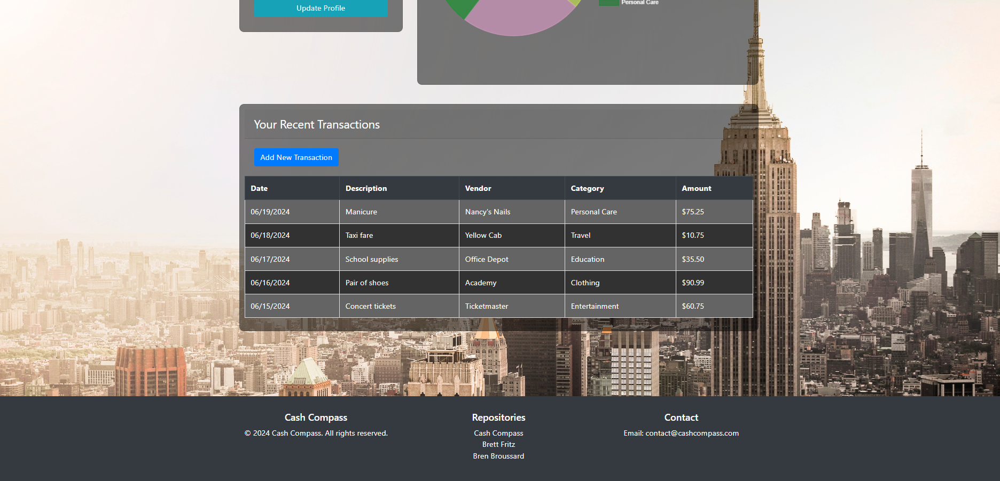
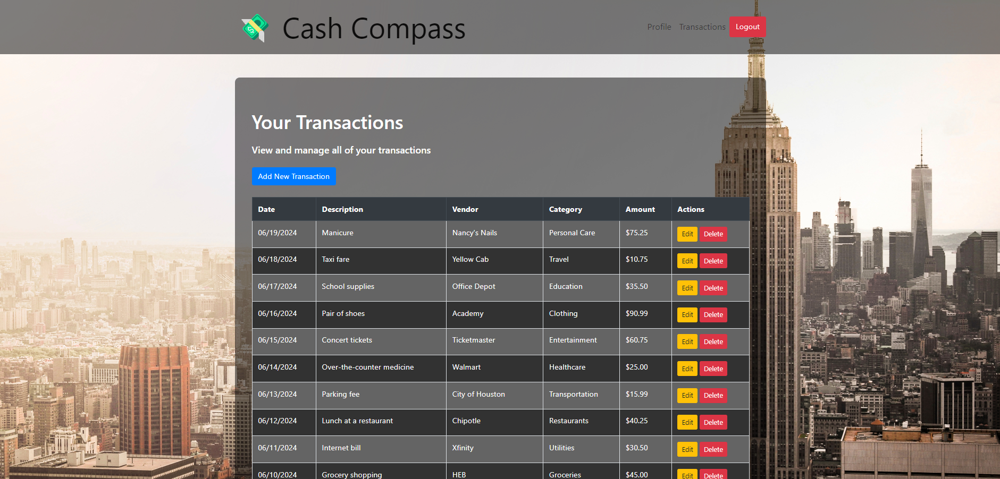
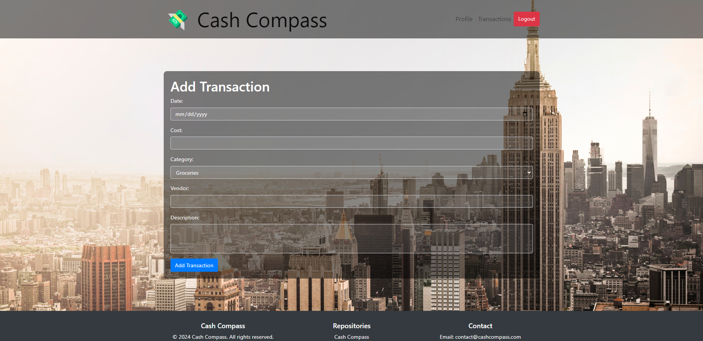
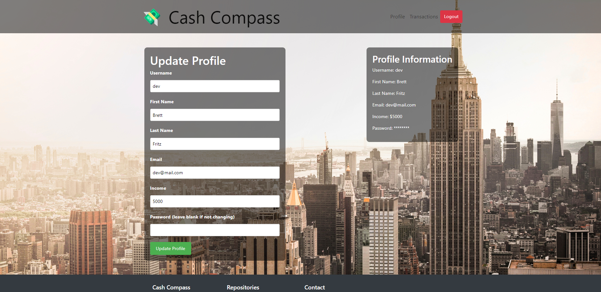

# Cash Compass

Cash Compass is a brand new finance app to help you achieve your financial freedom. We do this by letting you track every dollar of your finances in one place so you can see where your money is going. No money should ever be lost, you should always know exactly where you are putting your hard earned cash, and Cash Compass helps you with that

## Table of Contents
- [Demo/Description](#demo/description)
- [Features](#features)
- [Technologies Used](#technologies-used)
- [Setup Instructions](#setup-instructions)
- [License](#license)

## Demo/Description

1. In order to get started, paste the following link in your browser in order to navigate to the website. https://cash-compass.onrender.com
2. Upon loading you'll be greeted with our landing page where there is a button for you to sign up to start your journey

3. After clicking the sign up button you will be redirected to a form where you can fill out your personal information to get your account set up.

4. After signing up, you can revisit the website at anytime and access all of the features by simply logging in.

5. Once you have successfully signed up and/or logged in if you are revisiting, you will be redirected to you dashboard. Your dashboard brings all of your finances into one place, allowing you to see everything that you are spending your money on so that you can track it. First you have an account overview. The account overview displays your monthly income and the sum of all of your expenses. To the right you will see a pie chart showing what categories you have been spending the heaviest or the lightest. There is also a Quick Actions section where you can add a transaction, edit a transaction, and update your profile. Lastly at the bottom you will see a list of your 5 most recent transactions and their details. 

6. From here, by clicking the Transactions button in the header or the View All Transactions button from the Quick Actions, you will land at the Transactions page. You will be presented with a list of all of your transactions and the details for each.

7. Each transaction will have 2 buttons. One to delete the transaction, which will simply delete the transaction from your profile and update all of the data accordingly, and another to update a transaction. When clicking the update button on a transaction, your will be displayed a form with the current transaction information, and you are free to make the changes need. when you are done, simply click submit and those changes with be reflected throughout the app. 

8. Now say you just got home from shopping and you bought a new pair of shoes and you would like to add that to your financial profile. You can use the Add Transaction button for all purchases. Simply fill out the form with the details of the purchase and submit, and that transaction will be reflected throughout the app.

9. Say you've been using the app for a while and some of your personal information changed. Maybe you got a raise at work, or you got married and need to change your last name. You can update these things and more my clicking the Profile button in the header or the Update Profile button in the Quick Actions on the dashboard.

10. With that, you are free to use the app to help your reach your goals and achieve financial freedom!

## Features

- Dashboard to display an overview of your financial account
- Recent transactions on the dashboard
- Quick actions for adding a transaction, viewing all transactions, and updating profile information
- Track all of a user's transactions
  - Adding a transaction
  - Updating a transaction
  - Deleting a transaction
- Create a new user profile
  - Update a user profile
- Login and Logout functionallity

## Technologies Used

- HTML
- CSS
- Bootstrap
- Javascript
- jQuery
- Chart.js
- Handlebars.js
- Node.js
- Express.js
- Passport.js
- bcrypt.js
- Popper.js
- Sequelize
- Git
- Github
- JSON
- npm

## Setup Instructions

Simply follow the attached link to the live website to start managing your finances!

## Contributors
Brett Fritz - Repositories: https://github.com/brettfritz?tab=repositories

Bren Broussard - Repositories: https://github.com/brenj23?tab=repositories

## Links
Cash Compass Repository: https://github.com/brettfritz/cash-compass

Cash Compass Live Website: https://cash-compass.onrender.com

## License

MIT License
